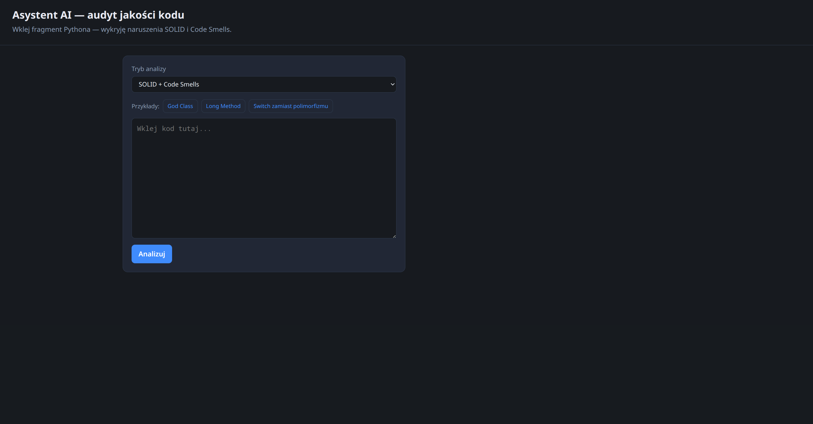
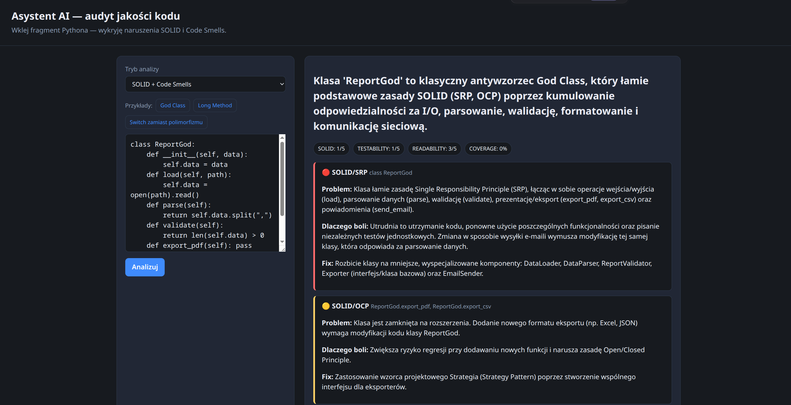
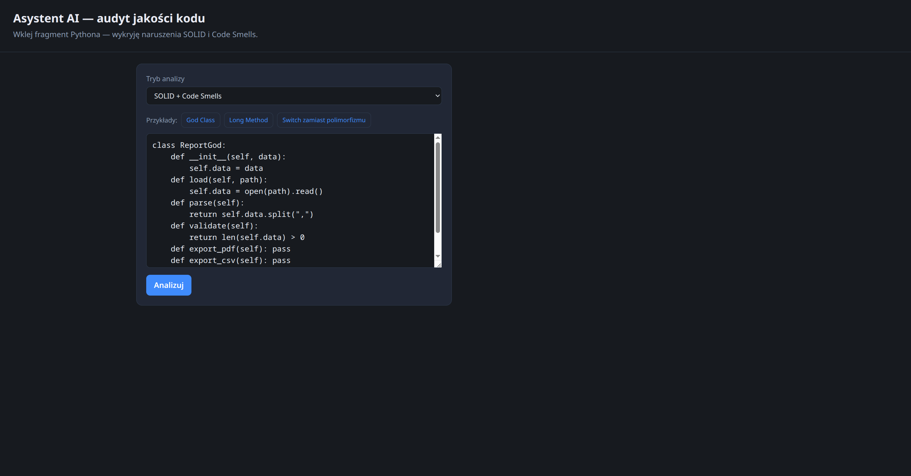

# SolidSmells — Asystent AI (SOLID & Code Smells)

Aplikacja webowa analizująca fragment kodu **Pythona** pod kątem naruszeń zasad **SOLID** i **Code Smells**, z wykorzystaniem **Google Gemini API**.

Projekt zrealizowany w ramach kursu *Testowanie oprogramowania i dokumentacja* — historia commitów odzwierciedla cykle **TDD (RED → GREEN → REFACTOR)**.

## Demo

| | |
|:---:|:---:|
| Formularz | Wynik analizy |
|  |  |

*Przykład God Class wczytany z przycisku „Przykłady”:*



## Funkcje

- Wklejanie fragmentu kodu Python i analiza przez LLM
- Tryby: **SOLID**, **Code Smells**, **SOLID + Code Smells**
- Strukturalna odpowiedź JSON: verdict, issues (severity), score, brakujące testy, propozycja refaktoryzacji
- Przyciski z przykładowym „złym” kodem (God Class, Long Method, Switch)
- REST API: `POST /api/review`

## Stos technologiczny

| Warstwa | Technologia |
|---------|-------------|
| Backend | Python 3.11+, Flask 3.x |
| LLM | google-genai (Gemini) |
| Konfiguracja | python-dotenv |
| Testy | unittest, coverage.py |
| Frontend | HTML, CSS, JavaScript (vanilla) |

## Architektura

```
Przeglądarka
    │  POST /api/review
    ▼
review_controller (Flask Blueprint)
    ▼
ReviewService  ──►  PromptBuilder  (prompt + schemat JSON)
    │                    │
    │                    ▼
    ├──►  LlmClient (Protocol / DIP)
    │         └── GeminiLlmClient (adapter)
    ▼
ResponseParser  ──►  modele: ReviewResult, Issue, …
```

- **SRP:** osobne klasy na prompt, parsowanie, orkiestrację
- **DIP:** `ReviewService` zależy od `LlmClient`, nie od konkretnego Gemini
- **OCP:** nowy język → wpis w `LANGUAGE_LABELS` bez zmiany logiki serwisu

## Instalacja

```bash
git clone https://github.com/<twoj-user>/SolidSmells.git
cd SolidSmells
python -m venv .venv
source .venv/bin/activate   # Windows: .venv\Scripts\activate
pip install -r requirements.txt
cp .env.example .env
```

W pliku `.env` ustaw:

```env
GEMINI_API_KEY=twój_klucz_z_AI_Studio
GEMINI_MODEL=gemini-3.5-flash
FLASK_DEBUG=1
```

Klucz API: [Google AI Studio](https://aistudio.google.com/app/apikey) — **nie commituj** `.env`.

## Uruchomienie

```bash
python run.py
```

Aplikacja: http://localhost:5000

**API (curl):**

```bash
curl -s -X POST http://localhost:5000/api/review \
  -H "Content-Type: application/json" \
  -d '{"code":"def f(): pass", "mode": "combined"}' | python -m json.tool
```

## Testy i pokrycie kodu

```bash
# wszystkie testy (26)
python -m unittest discover -s test -v

# pokrycie (moduły logiczne src/ — bez app_factory i config)
coverage run -m unittest discover -s test
coverage report -m
coverage html   # raport: htmlcov/index.html
```

Ostatni pomiar: **~98%** na warstwie `src/models` + `src/services` (wymaganie kursu: ≥ 85%).

Testy integracyjne używają **Fake LLM** — bez wywołań API w CI.

## Struktura repozytorium

```
SolidSmells/
├── run.py
├── requirements.txt
├── .env.example
├── .coveragerc
├── src/
│   ├── app_factory.py
│   ├── config.py
│   ├── controllers/
│   ├── models/
│   ├── services/
│   ├── templates/
│   └── static/
├── test/
│   ├── fixtures/
│   └── test_*.py
└── docs/screenshots/
```

## Mapowanie na wymagania kursu

| Temat | Realizacja w projekcie |
|-------|------------------------|
| AAA (L01) | komentarze Arrange / Act / Assert w testach |
| unittest, setUp (L02) | `test_review_controller`, `discover` |
| TDD RED/GREEN/REFACTOR (L03) | historia commitów na GitHub |
| Code coverage (L04) | `.coveragerc`, raport ≥ 85% |
| SOLID (L05) | SRP, DIP (`LlmClient`), OCP (`LANGUAGE_LABELS`) |
| Code smells (L06) | audyt LLM + czysty kod w Pythonie |
| Mock / Fake (L07) | `Mock(spec=…)`, `FakeLlmClient` w integracji |
| Enkapsulacja (L08) | `@dataclass(frozen=True)` |
| Walidacja wejścia (L10) | modele, kontroler 400, parser 502 |
| Dokumentacja (L11) | README, screenshoty, API |

## Autor

Projekt studencki — repozytorium: `SolidSmells`.
